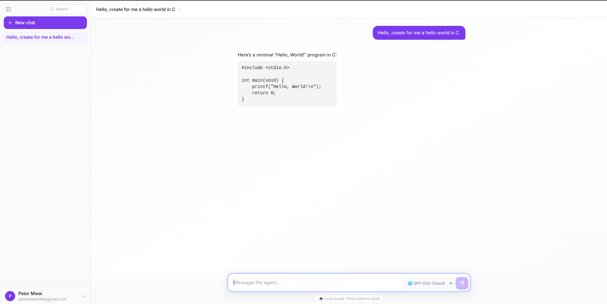
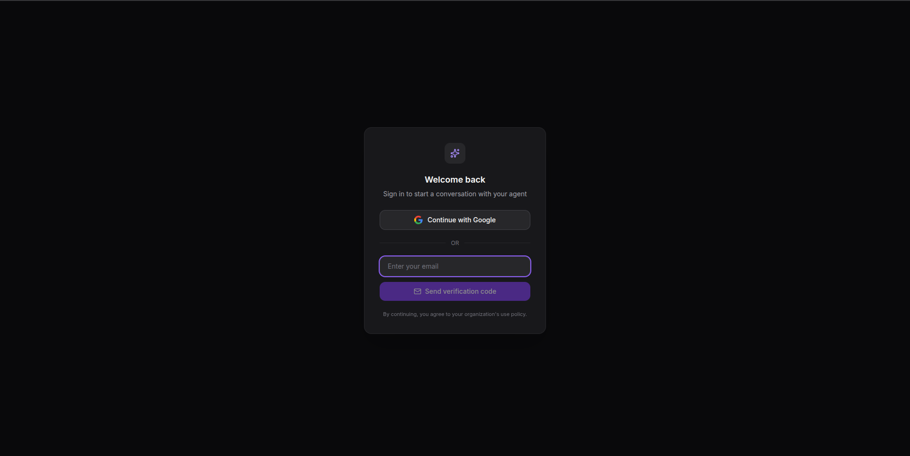

# AI Chat

Your own private ChatGPT-style AI assistant that you run on your own
computer. Sign in with Google, chat with an AI model, and your
conversations stay on your machine — not on someone else's server.

This project is free to use, fork, and modify. If you can install an app
and copy-paste a few things into a text file, you can run this.

---

## What it looks like




---

## What you'll need before starting

- A computer running Windows, Mac, or Linux
- About 20 minutes
- A free Google account (for sign-in)
- A free or paid [Ollama](https://ollama.com) account (this is what
  actually powers the AI responses)

You don't need to know how to code. You will need to copy and paste a few
commands into a program called a **terminal** (Mac/Linux) or **PowerShell**
(Windows) — this is just a text-based window for typing commands, and
every step below tells you exactly what to type.

---

## Step 1 — Install Docker

This app runs inside something called **Docker** — think of it as a box
that contains the whole app and everything it needs, so it runs the same
way on any computer.

- **Windows or Mac**: download [Docker Desktop](https://www.docker.com/products/docker-desktop/), open the installer, click through it (like installing any other program), then restart your computer if it asks you to.
- **Linux**: follow the [official install guide](https://docs.docker.com/engine/install/) for your distribution.

Once installed, open Docker Desktop and leave it running in the
background — it needs to be open for the app to work.

---

## Step 2 — Download this project

**Easiest way (no technical knowledge needed):**
1. At the top of this page, click the green **Code** button, then **Download ZIP**.
2. Find the downloaded ZIP file and extract/unzip it somewhere you'll remember, like your Desktop.

**If you're comfortable with git instead:**
```bash
git clone https://github.com/petermwai549/AI-Chat.git
```

---

## Step 3 — Open a terminal in the project folder

- **Windows**: open the extracted folder in File Explorer, hold `Shift` and right-click inside it, choose **"Open PowerShell window here"**.
- **Mac**: open the extracted folder in Finder, right-click it, choose **Services → New Terminal at Folder** (if you don't see this option, open Terminal from Applications and type `cd ` followed by dragging the folder into the window, then press Enter).
- **Linux**: right-click inside the folder in your file manager and look for **"Open Terminal Here"**.

Keep this window open — you'll use it for the remaining steps.

---

## Step 4 — Set up your configuration file

The app needs a few settings and passwords, kept in a file called `.env`.
A template is provided — copy it and fill it in.

In your terminal:
```bash
cp .env.example .env
cp frontend/.env.example frontend/.env
```

Now open the new `.env` file in any text editor (Notepad, TextEdit, or
[VS Code](https://code.visualstudio.com/) all work fine) and fill in the
blank values. The file has comments explaining each one — most can be left
as-is, but a few need real values from the next two steps.

---

## Step 5 — Set up Google Sign-In

This lets people log into the app with their Google account, the same way
you'd sign into any other website "with Google" — no separate password to
remember.

1. Go to the [Google Cloud Console](https://console.cloud.google.com/) and sign in with any Google account.
2. At the top, click the project dropdown → **New Project**. Give it any name (e.g. "My AI Chat") and click **Create**.
3. Once created, make sure your new project is selected in that same dropdown.
4. In the left sidebar, go to **APIs & Services → OAuth consent screen**. Choose **External**, click **Create**, and fill in the required fields (app name, your email) — you can leave most fields blank and click through to **Save and Continue** on each page.
5. In the left sidebar, go to **APIs & Services → Credentials**.
6. Click **+ Create Credentials → OAuth client ID**.
7. For "Application type", choose **Web application**.
8. Under **Authorized JavaScript origins**, add: `http://localhost:5270`
9. Under **Authorized redirect URIs**, add: `http://localhost:5270/oauth/callback`
10. Click **Create**. A box pops up showing your **Client ID** and **Client Secret** — copy both.

Paste them into your `.env` file:
```
GOOGLE_CLIENT_ID=paste-your-client-id-here
GOOGLE_CLIENT_SECRET=paste-your-client-secret-here
```

And also into `frontend/.env`:
```
VITE_GOOGLE_CLIENT_ID=paste-the-same-client-id-here
```

---

## Step 6 — Set up Ollama (the AI itself)

Ollama is the service that actually generates the AI's responses.

1. Go to [ollama.com](https://ollama.com) and create a free account.
2. Once signed in, look for **API Keys** in your account settings (usually under your profile menu).
3. Click **Create API Key**, give it any name, and copy the key it shows you — you won't be able to see it again later.

Paste it into your `.env` file:
```
OLLAMA_API_KEY=paste-your-ollama-key-here
```

> **Prefer not to use a paid cloud service?** Ollama can also run entirely
> on your own computer for free (no API key needed), if it's powerful
> enough to run AI models locally. That's a more advanced setup — see
> [ollama.com/download](https://ollama.com/download) and change
> `OLLAMA_HOST` in `.env` to point at your local Ollama instead of the
> cloud one.

---

## Step 7 — Generate two security keys

Your `.env` file also needs two random secret values, `JWT_SECRET` and
`API_KEY`. These protect login sessions — never reuse example values from
a tutorial, always generate your own.

If you have a terminal open already, run this twice (once for each):
```bash
openssl rand -hex 32
```
Copy each result into the matching line in `.env`. No terminal comfort?
Any long random mix of 32+ letters and numbers works — your password
manager's "generate password" button is a fine substitute.

Also copy your `API_KEY` value into `frontend/.env`'s `VITE_API_KEY`.

---

## Step 8 — Start the app

Back in your terminal, in the project folder, run:
```bash
docker compose up -d
```
The first time you run this, it downloads everything it needs — this can
take a few minutes depending on your internet connection. You'll see a lot
of text scroll by; that's normal.

Give it about a minute after it finishes to let everything fully start up
before continuing to the next step.

---

## Step 9 — One-time setup (only needed the very first time)

Two commands to run once, right after the app starts up for the first
time ever. You won't need to repeat these on future startups.

**Create the database tables:**
```bash
docker compose exec -T postgres psql -U aichat -d ai-agent < schema.sql
```
*(If you changed `POSTGRES_USER` or `POSTGRES_DB` in your `.env` file from
their default values, use those instead of `aichat` and `ai-agent` above.)*

**Set up the API routes:**
```bash
./migrate-routes.sh
```

If either command shows errors instead of finishing quietly, double-check
`docker compose ps` shows everything as "Up" first — these two steps need
the app's containers to already be running.

---

## Step 10 — Open the app

In your browser, go to:
```
http://localhost:5270
```

You should see the sign-in screen. Click **Continue with Google** and
you're in.

---

## Using the app day to day

Once it's set up, you don't need to repeat all those steps again. Just:

- **To start it**: open a terminal in the project folder and run `docker compose up -d`
- **To stop it**: run `docker compose down`
- **To use it**: visit `http://localhost:5270` in your browser while it's running

---

## Checking how your instance is doing (optional)

If you're running this for yourself or a small group, you probably don't
need this — it's mainly useful if you want to keep an eye on things like
how many people are chatting, how fast responses are, or whether anything
is running low on resources.

This comes built in — **you don't need to install or set up anything
extra**. The dashboards and alerts are already included in this project
and load automatically the moment you start the app.

To view them:
1. Make sure the app is running (`docker compose up -d`)
2. Open your browser to: `http://localhost:6100`
3. Log in with the `GRAFANA_USER` and `GRAFANA_PASSWORD` you set in your `.env` file (defaults to username `admin` if you didn't change it)
4. You'll land on a dashboard showing live stats about your AI Chat instance

That's it — no configuration, no importing files, it's ready as soon as
the app is.

---

## Something not working?

- **Nothing loads at `localhost:5270`** — check Docker Desktop is open and running, and give it another minute after `docker compose up -d` — some pieces take a moment to start.
- **"Port already in use" error** — something else on your computer is already using that port. Close other apps that might use it, or ask for help changing the port in `docker-compose.yml`.
- **Google sign-in gives an error** — double check the exact URLs in Step 5 match `http://localhost:5270` precisely (no trailing slash, `http` not `https`).
- For anything deeper, see [docs/TROUBLESHOOTING.md](./docs/TROUBLESHOOTING.md).

*Already run your own web server and want a nicer local address than a
port number? See [docs/CUSTOM-DOMAIN.md](./docs/CUSTOM-DOMAIN.md) — this
is entirely optional, the app works fine without it.*

---

## Want to know how it works under the hood?

This app is built from several small services working together (a
database, a message queue, an API gateway, and more) — see
[docs/ARCHITECTURE.md](./docs/ARCHITECTURE.md) for the full technical
breakdown, diagrams, and how a message flows through the system.

---

## Contributing

Forks and pull requests are welcome. If you run into a bug or have an
idea, open an issue — no need to be an expert, "this didn't work for me"
is a perfectly good bug report.

---

## License

*(Choose a license and add it here — [MIT](https://choosealicense.com/licenses/mit/) is a common, permissive choice for projects like this if you want others to freely use and build on it. Add a `LICENSE` file with your choice.)*