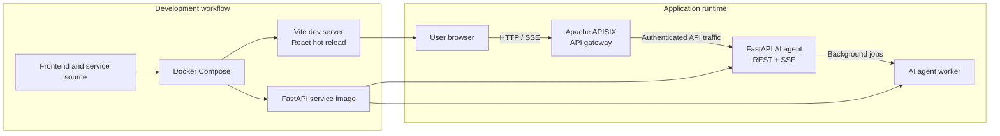
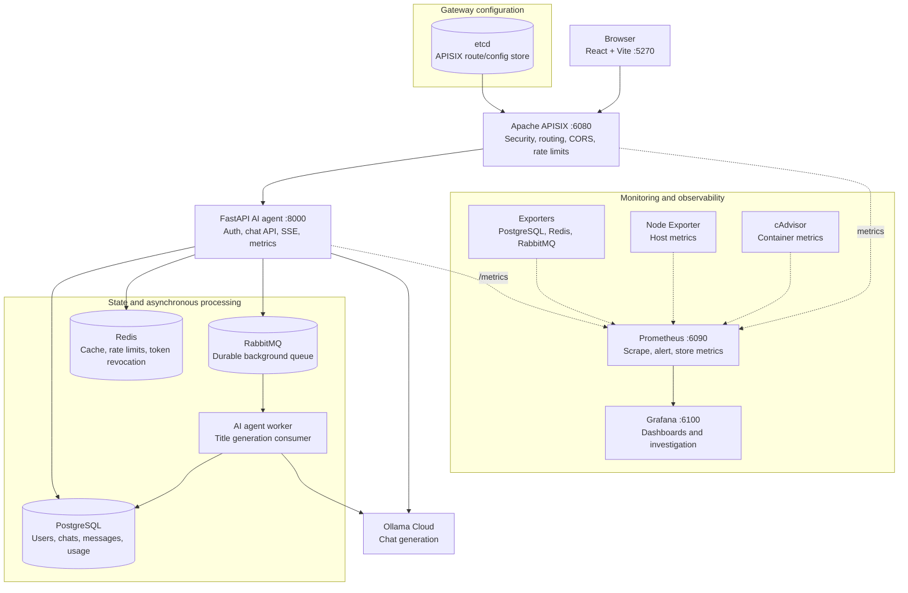
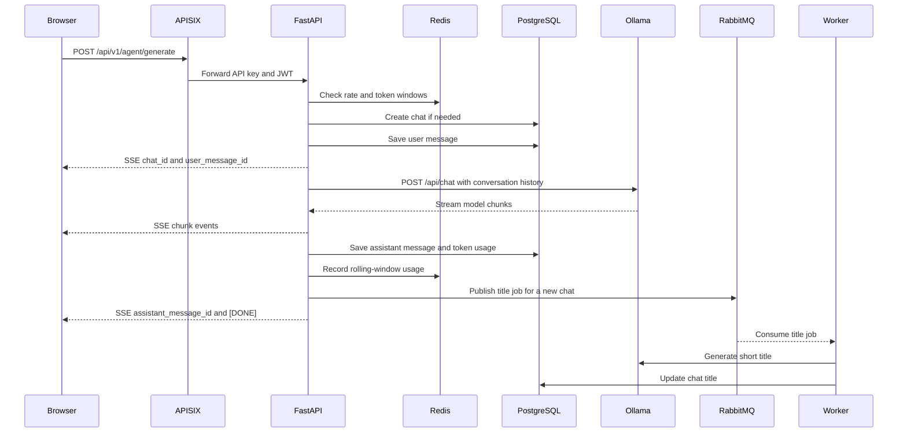
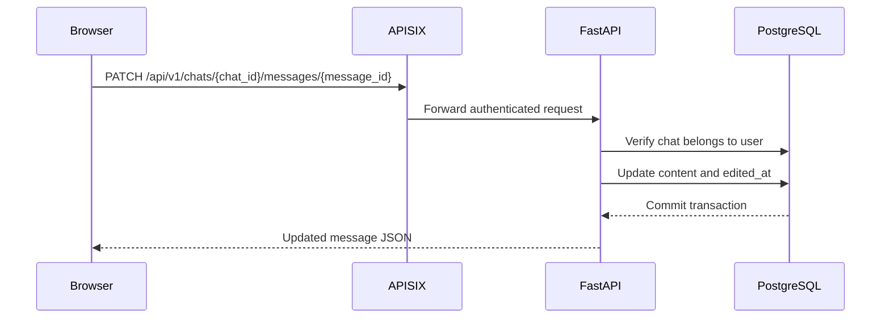

# Microservices Ecosystem

An AI chat application built as a Docker Compose microservices ecosystem. The
React frontend communicates with a FastAPI service through Apache APISIX. The
service stores users, chats, messages, and token usage in PostgreSQL, uses Redis
for rate limits and token revocation, and sends background chat-title jobs to
RabbitMQ. Model responses are provided by Ollama Cloud.

## Full system architecture

The ecosystem is developed and operated as one Docker Compose stack. Source
changes are mounted into the Vite frontend for hot reload, while the API and
worker are built from the same FastAPI service image. At runtime, every client
request enters through Apache APISIX, which provides the security and traffic
control boundary before forwarding requests to the application service.

### From development to runtime



### Runtime ecosystem



APISIX is the public API boundary: it routes requests, applies CORS and rate
limiting, exposes gateway metrics, and keeps its route configuration in etcd.
The FastAPI service owns authentication and application behavior. PostgreSQL
is the source of truth for durable data, Redis provides fast security and
usage controls, and RabbitMQ keeps background title generation out of the
interactive response path. Prometheus scrapes APISIX, FastAPI, exporters,
the host, and containers; Grafana reads Prometheus to display the operational
state of the whole ecosystem.

### Components

| Component | Responsibility | Local address |
| --- | --- | --- |
| Frontend | React chat UI, auth state, SSE rendering | http://localhost:5270 |
| Apache APISIX | API routing, CORS, rate limiting, gateway metrics | http://localhost:6080 |
| FastAPI service | Authentication, chat APIs, model streaming, metrics | http://localhost:8000 |
| AI agent worker | Consumes title jobs without blocking chat responses | Internal only |
| PostgreSQL | Durable application data | Internal only |
| Redis | Rate limits, rolling token usage, revoked-token checks | Internal only |
| RabbitMQ | Asynchronous chat-title events | http://localhost:15672 |
| Prometheus | Metrics collection and alert evaluation | http://localhost:6090 |
| Grafana | Dashboards backed by Prometheus | http://localhost:6100 |
| Ollama Cloud | LLM response and title generation | Configured by `OLLAMA_HOST` |

etcd is the APISIX configuration store. cAdvisor and Node Exporter provide
container and host metrics. The Ofelia container periodically prunes Docker
images and build cache.

## Request flows

### Generate and save a chat response



The frontend sends `apikey`, the current user ID, and a Bearer JWT. The API
validates both the JWT and API key. Model output is sent as Server-Sent Events,
so the UI can render the answer while it is generated.

### Save an edited message



### Regenerate a response

Regeneration uses the same generation endpoint. The frontend submits a new
prompt with the existing `chat_id`; the service verifies ownership, loads the
stored conversation history, saves the new user message, streams a fresh Ollama
response, and persists the new assistant message and usage record.

## Prerequisites

- Docker Engine and Docker Compose v2 (`docker compose`)
- A browser
- An Ollama Cloud API key and an available model, by default
	`gpt-oss:20b`
- Google OAuth credentials if Google sign-in is enabled
- SMTP credentials if email verification is enabled

## Configuration

Create a root `.env` file. Do not commit it.

```dotenv
POSTGRES_USER=zeus
POSTGRES_PASSWORD=replace-with-a-strong-password
POSTGRES_DB=ai-agent
RABBITMQ_USER=zeus
RABBITMQ_PASSWORD=replace-with-a-strong-password
REDIS_PASSWORD=replace-with-a-strong-password
OLLAMA_HOST=https://ollama.com
OLLAMA_API_KEY=replace-with-your-ollama-key
JWT_SECRET=replace-with-a-long-random-secret
API_KEY=replace-with-a-long-random-api-key
GOOGLE_CLIENT_ID=optional-google-client-id
GOOGLE_CLIENT_SECRET=optional-google-client-secret
EMAIL_HOST=smtp.gmail.com
EMAIL_PORT=587
EMAIL_USER=optional-smtp-user
EMAIL_PASSWORD=optional-smtp-password
EMAIL_FROM=optional-sender
GRAFANA_USER=admin
GRAFANA_PASSWORD=replace-with-a-strong-password
```

The compose file has development fallbacks, but replacing them is strongly
recommended. The frontend reads `VITE_API_ORIGIN`, `VITE_API_KEY`, and
`VITE_GOOGLE_CLIENT_ID` at build/start time. When using the Docker frontend,
the gateway origin defaults to `http://localhost:6080` and the frontend API
key should match the backend `API_KEY`:

```dotenv
VITE_API_ORIGIN=http://localhost:6080
VITE_API_KEY=replace-with-the-same-api-key
VITE_GOOGLE_CLIENT_ID=optional-google-client-id
```

## Run locally

From the repository root:

```bash
docker compose up -d --build
docker compose ps
```

Initialize the database once after PostgreSQL becomes healthy:

```bash
docker exec -i postgres-db psql -U "${POSTGRES_USER:-zeus}" \
	-d "${POSTGRES_DB:-ai-agent}" < schema.sql
```

Register APISIX routes when the gateway has started:

```bash
./migrate-routes.sh
```

Open the application at http://localhost:5270. Useful service URLs are:

- Health: http://localhost:6080/health
- FastAPI docs: http://localhost:8000/docs
- RabbitMQ management: http://localhost:15672
- Prometheus: http://localhost:6090
- Grafana: http://localhost:6100

The default Grafana login is the values of `GRAFANA_USER` and
`GRAFANA_PASSWORD`.

View logs with:

```bash
docker compose logs -f ai-agent-service ai-agent-worker apisix frontend
```

Stop the stack while keeping data:

```bash
docker compose down
```

## Reset all data

This removes PostgreSQL, Redis, RabbitMQ, monitoring, and APISIX volumes. Use
it only when a clean development environment is required:

```bash
docker compose down -v
docker compose up -d --build
docker exec -i postgres-db psql -U "${POSTGRES_USER:-zeus}" \
	-d "${POSTGRES_DB:-ai-agent}" < schema.sql
./migrate-routes.sh
```

Do not use `docker system prune -af` as part of normal setup; it removes
unrelated local Docker images and build cache.

## Development commands

The frontend runs in a bind-mounted Vite development container, so edits under
`frontend/src` hot reload in the browser. To run frontend tooling locally:

```bash
cd frontend
npm ci
npm run lint
npm run build
```

The FastAPI image installs dependencies from
`services/ai-agent-service/requirements.txt`; the API and worker share the
same image and source tree.

## Troubleshooting

- Check readiness with `docker compose ps` and inspect failures using
	`docker compose logs <service>`.
- If the API returns `502`, wait for APISIX and the FastAPI container, then run
	`./migrate-routes.sh` again.
- If the browser reports a CORS error, confirm that the frontend origin is
	allowed by the APISIX routes and that the frontend is using port `5270`.
- If generation fails, verify `OLLAMA_HOST`, `OLLAMA_API_KEY`, and the model
	name in `frontend/src/config.js`.
- If authentication fails, ensure the frontend `VITE_API_KEY` equals the
	backend `API_KEY`, and recreate the frontend container after changing it.

## Repository layout

```text
gateway/                  APISIX and etcd configuration
frontend/                 React + Vite client
services/ai-agent-service FastAPI API and RabbitMQ worker
monitoring/               Prometheus configuration and Grafana dashboards
schema.sql                PostgreSQL schema
migrate-routes.sh         APISIX route registration helper
docker-compose.yml        Complete local ecosystem
```