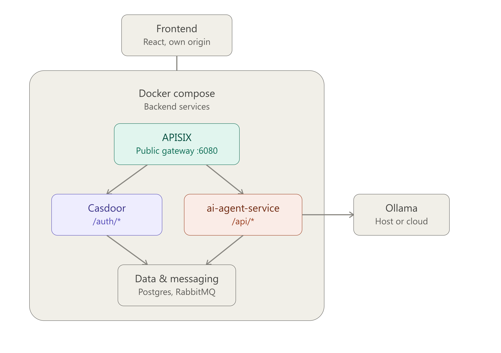
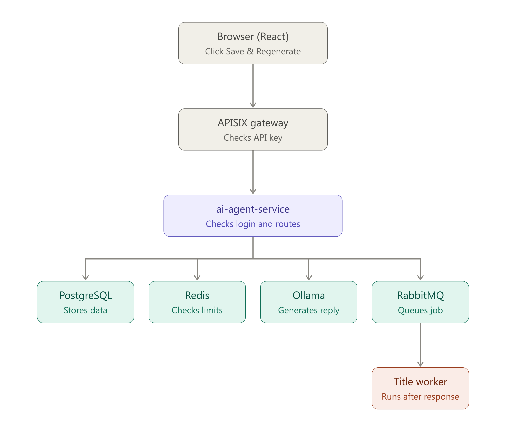

# Architecture

Technical reference for how the pieces fit together. If you just want to
run the app, you don't need this — see the main [README](../README.md).
This is for contributors, or anyone curious about the internals.

## Diagram



**Every request from the frontend goes through the APISIX gateway first**,
not directly to the backend. APISIX handles CORS, rate limiting, and
metrics collection at the edge before forwarding to `ai-agent-service`.

## Request flow: sending a message



1. **Browser** — person sends a message (or clicks "Save & Regenerate").
2. **APISIX gateway** — checks the `apikey` header before forwarding.
3. **ai-agent-service** — validates the session, then fans out:
   - **PostgreSQL** — persists the message
   - **Redis** — checks rolling token-usage limits (5h/daily/weekly)
   - **Ollama** — generates the reply, streamed back over SSE
   - **RabbitMQ** — queues a background job
4. **`ai-agent-worker`** (background) — picks the job up *after* the
   response finishes streaming, and generates a title for brand-new chats.
   This is deliberately asynchronous — a new chat's title appearing a beat
   after the first reply is expected behavior, not a bug.

## Services

| Service | Container | Purpose | Port (host) |
|---|---|---|---|
| `etcd` | `apisix-etcd` | Config store backing APISIX (routes, plugins) | internal only |
| `apisix` | `apisix-gateway` | API gateway — routing, CORS, rate limiting | `6080` (public), `9180` (Admin API, `127.0.0.1` only) |
| `rabbitmq` | `rabbitmq-backbone` | Message queue for background jobs | `127.0.0.1:5672`, `127.0.0.1:15672` (mgmt UI) |
| `postgres` | `postgres-db` | Primary relational database | internal only |
| `postgres-exporter` | — | Prometheus metrics for Postgres | `9187` |
| `redis` | `redis-cache` | Cache / rate-limit counters / session data | internal only |
| `redis-exporter` | — | Prometheus metrics for Redis | `9121` |
| `ai-agent-service` | — | FastAPI backend: chat, auth, streaming | `8000` |
| `ai-agent-worker` | — | RabbitMQ consumer — background jobs (e.g. auto-titling) | — |
| `frontend` | `frontend` | React + Vite dev server, hot reload | `127.0.0.1:5270` |
| `pruner` | `docker_pruner` | Weekly Docker image/build-cache cleanup (Ofelia) | — |
| `cadvisor` | — | Per-container resource metrics | `8090` |
| `node-exporter` | — | Host-level system metrics | `9100` |
| `prometheus` | — | Metrics aggregation | `127.0.0.1:6090` |
| `grafana` | — | Dashboards | `127.0.0.1:6100` |

The monitoring stack (`prometheus`, `grafana`, `cadvisor`, `node-exporter`,
`*-exporter` services) is optional — it's useful if you're running this for
a group and want visibility into usage/health, but adds real resource
overhead for a single-person local install. It can be split into a
separate Compose profile if you'd rather not run it by default; not done
yet, flagged here as a reasonable future improvement.

## Project structure

```
microservices-ecosystem/
├── docker-compose.yml
├── .env.example
├── .dockerignore
├── .gitignore
├── schema.sql
├── apache/
│   └── frontend-vhost.conf        (optional reverse-proxy config)
├── scripts/
│   ├── dev.sh
│   ├── frontend-idle-stop.sh
│   └── docker-prune.sh
├── frontend/
│   ├── .env.example
│   ├── Dockerfile                  (production build, manual use)
│   ├── Dockerfile.dev               (active — dev server)
│   ├── nginx.conf                   (SPA routing fallback, prod build only)
│   └── ...
├── services/
│   └── ai-agent-service/
│       ├── Dockerfile
│       ├── requirements.txt
│       └── app/
│           ├── config.py
│           ├── main.py
│           └── worker.py
├── gateway/
│   ├── config.yaml
│   └── apisix_config.yaml          (reference only — see Troubleshooting)
└── monitoring/
    └── ...
```

See [TROUBLESHOOTING.md](./TROUBLESHOOTING.md) for known gotchas around
ports, CORS, and the APISIX/etcd configuration split.
